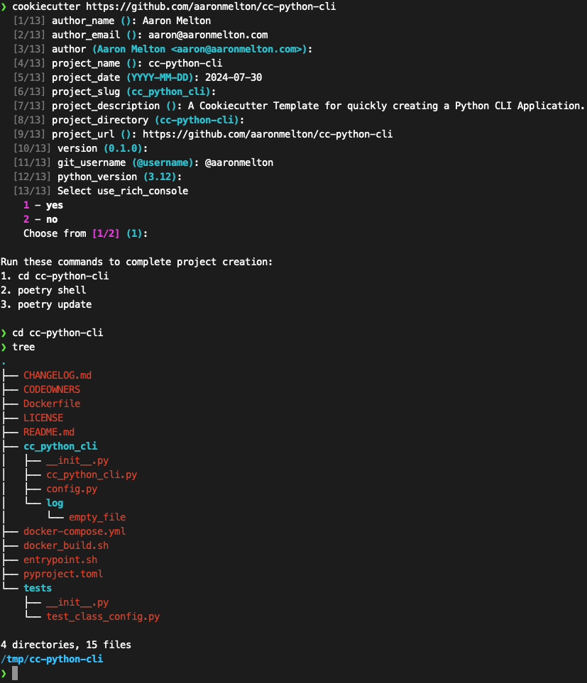

# Cookiecutter Template for Python CLI Applications

A Cookiecutter Template for quickly creating a Python CLI Application.

## Getting Started

### About This Code

This Cookiecutter Template was created to accelerate the creation of new Python
code repositories that contain all the basic files and minimum functionality
required to begin a working CLI Python project.

Code generated by this boilerplate is designed to pass Python PEP, linting and
security checks using my [run_code_checks.sh](https://gist.github.com/aaronmelton/385b69524588facbc948742d7f22c8fc) shell script.

### Requirements

* [cookiecutter Python package](https://github.com/cookiecutter/cookiecutter)
* [poetry](https://python-poetry.org/) for package management
* [aaron_common_libs](https://github.com/aaronmelton/aaron-common-libs) for various common classes used in my scripts.

### Instructions For Use

#### Installation

1. Use Cookiecutter to create a new Python project: `cookiecutter https://github.com/aaronmelton/cc-python-cli`
2. Answer the questions as prompted by Cookiecutter.  Answers to these questions are used as variables to populate various files in the script.
* `project_url` is the URL of the git repository for this script (assuming you will use one).
* `git_username` is your GitHub or GitLab username with `@` as part of the prefix.
* `use_rich_console` if you wish to use the [rich](https://github.com/Textualize/rich) library for cool terminal formatting (optional).
3. Follow the suggested commands (`poetry shell` and `poetry update`) to initialize the project.
4. Use my [run_code_checks.sh](https://gist.github.com/aaronmelton/385b69524588facbc948742d7f22c8fc) script and address any findings (if you care about that sort of thing).

#### Python Commands

`python cc_python_cli.py --help` for help.

The script provides two different methods for calling subcommands:

`python3 cc_python_cli.py test --test1` as an example to call a subcommand that doesn't require input.

`python3 cc_python_cli.py test --test2 bar` as an example to call a subcommand where you need to pass a string as input.

Optional:

Modify `required_vars = {}` to include any variables that are required for the script to run (prevents script from running and failing during execution due to missing variables).

Update accordingly: `required_vars = {"some_api_key": config.key_dict["api_key"]}`

#### Docker Commands

Use provided `docker_build.sh` to build and push Docker images.
1. `1) Code Check` to test building image and running code checks. Fails on code issues.
2. `2) Development` to create an image tagged as `development`.
3. `3) Test` to create an image tagged as `test`.  Prompts user to push Docker Image to repository after creation.
4. `4) Production` to create an image taggged with a version number and `latest`.  Prompts user to provide version number and push Docker Image to repository after creation.

## Authors
* **Aaron Melton** - *Author* - Aaron Melton <aaron@aaronmelton.com>